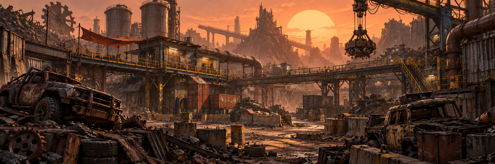

# Scrapline

<!-- project-header:start -->

<!-- project-header:end -->

<!-- project-badges:start -->

<!-- project-badges:end -->

<!-- project-live-badges:start -->
  
<!-- project-live-badges:end -->

Scrapline is a compact post-apocalyptic free-for-all map for Unreal Editor for Fortnite (UEFN), built from a deliberately curated Fab/UEFN production-asset pool.

## Project Goal

Build a polished, immediately playable FFA arena in one focused implementation pass. The environment should feel authored from real production assets rather than greybox geometry.

## Core Direction

- Mode: Free For All
- Platform: UEFN / Fortnite
- Theme: dense post-apocalyptic scrapyard / industrial wasteland
- Target feel: fast combat, short downtime, strong landmarks, layered routes, controlled verticality
- Construction rule: prefer approved UEFN/Fab assets over primitive placeholder geometry or newly modeled substitutes

## Current Stage

**Asset manifest frozen for the one-shot.**

The macro map design, terrain specification, first-alpha gameplay baseline, UEFN/Codex toolchain, and production environment kit are now locked or verified. The final live curation pass added Factory machinery/hero pieces, two vehicle silhouettes, Garage/workshop assets, a complete modular pipe vocabulary, and a restrained industrial warning-decal subset.

The next gates are Verse generation/validation, finalizing the Codex one-shot handoff, executing the primary build, and then testing/repair.

## Documentation

- `docs/PROJECT_BRIEF.md` — product intent and non-negotiable build rules
- `docs/ASSET_MANIFEST.md` — **frozen** approved asset sources and implementation-visible paths
- `docs/ASSET_GAP_MATRIX.md` — final required-family coverage and closed intake decision
- `docs/MAP_DESIGN.md` — locked macro combat-space and layout direction
- `docs/TERRAIN_ENVIRONMENT_SPEC.md` — implementation-facing terrain and environment plan
- `docs/GAMEPLAY_SPEC.md` — first-alpha FFA gameplay baseline
- `docs/UEFN_CENTRAL_PROMPT.md` — prepared Verse Project Generator request
- `docs/TOOLING.md` — approved Codex/UEFN build toolchain and activation checklist
- `docs/ASSET_PIPELINE.md` — referenced/FBX/donor-project intake workflow and safety rules
- `docs/FAB_LIBRARY_AUDIT.md` — 160-product ownership audit and final intake disposition
- `docs/ASSET_RECOVERY.md` — recovered Fab payloads and repaired UE 5.6 staging workflow
- `docs/BUILD_READINESS.md` — current one-shot readiness snapshot
- `docs/ONE_SHOT_PROMPT_DRAFT.md` — finalize after Verse generation/validation
- `AGENTS.md` — repository-wide DOX contract
